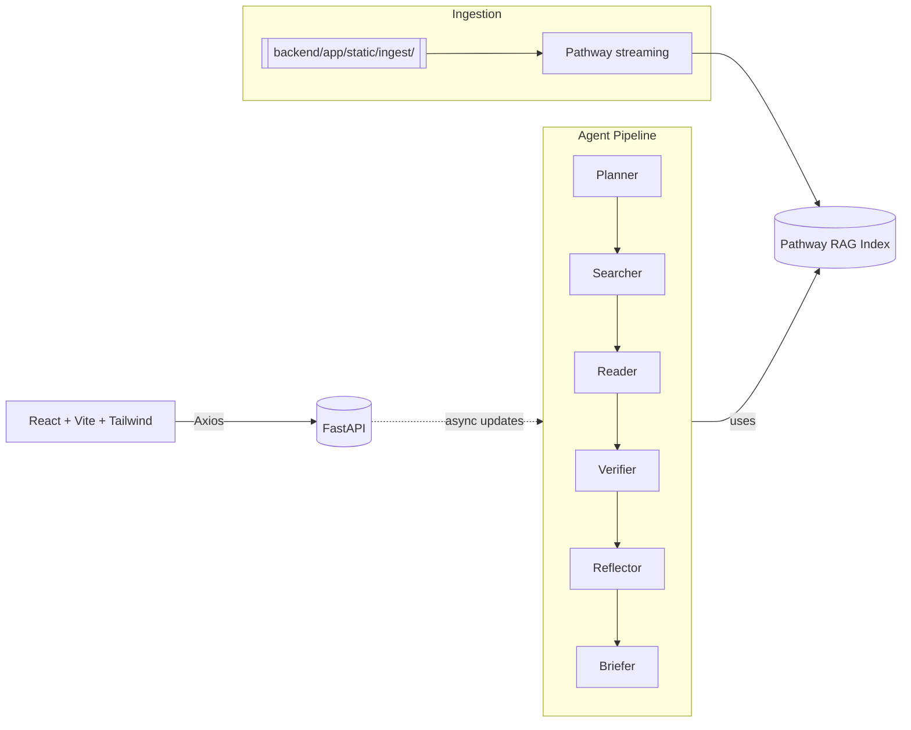

# AI Research Agent (FastAPI + React)

Hackathon-ready, end-to-end AI Research Agent that plans, searches, reads, verifies, reflects, and briefs on any topic. It pairs a FastAPI backend with a modern React + Vite + Tailwind UI. Retrieval is powered by a Pathway-backed streaming RAG index that also works with zero API keys.

## Why this is different (at a glance)
- **Pathway RAG, streaming ingestion**: Documents dropped into `backend/app/static/ingest/` are ingested live into a vector index (via Pathway). The agent’s Search/Read steps query this live index instead of scraping every time.
- **Works without Gemini/OpenAI keys**: If `GOOGLE_API_KEY` is not set, the app gracefully falls back to deterministic embeddings and a heuristic generator. You can demo everything offline.
- **Agentic pipeline you can inspect**: Planner → Searcher → Reader → Verifier → Reflector → Briefer, with progress surfaced via the API and UI.
- **Modern stack**: FastAPI + Uvicorn backend, React + Vite + Tailwind on the frontend, plus MUI components for speed.

## Table of Contents
- [Architecture](#architecture)
- [How Pathway RAG is implemented](#how-pathway-rag-is-implemented)
- [No-API-Key mode (how it still works)](#no-api-key-mode-how-it-still-works)
- [How it differs from Gemini/ChatGPT](#how-it-differs-from-geminichatgpt)
- [APIs](#apis)
- [Setup](#setup)
- [Frontend (React + Vite + Tailwind)](#frontend-react--vite--tailwind)
- [Backend (FastAPI)](#backend-fastapi)
- [Docker (Backend)](#docker-backend)
- [Feeding your own data](#feeding-your-own-data)
- [Demo script](#demo-script)
- [FAQ](#faq)

## Architecture


- Backend entrypoint: `backend/app/main.py`
- Agent logic: `backend/app/agent.py`
- Model init + fallback: `backend/app/models.py`
- Pathway RAG implementation: `backend/app/pathway_rag.py`

## How Pathway RAG is implemented
Code: `backend/app/pathway_rag.py`

- **Streaming filesystem source**: Pathway watches `backend/app/static/ingest/` and builds a live table of documents (supports `.txt`, `.md`, `.csv`, `.jsonl`).
- **Normalization UDFs**: Each file is parsed into a normalized row `{id, title, url, content}`.
- **Embeddings**: `text-embedding-004` via Gemini when `GOOGLE_API_KEY` is available. Otherwise, a deterministic hashing-based vector is used so the system still functions.
- **Vector similarity**: Simple cosine similarity over embeddings for `search_sources` and `read_documents`.
- **Python mirror**: A small in-memory mirror is maintained so FastAPI endpoints can synchronously query top-k results without waiting on the Pathway runtime.
- **Programmatic ingestion**: The agent can push freshly fetched web pages into the live index via `pathway_ingest_external(docs)`.

Where it’s used:
- `agent._search()` calls `pathway_search(query, top_k=12)` and falls back to DuckDuckGo HTML scraping only if the index is empty (then ingests results and re-queries).
- `agent._read()` calls `pathway_read(query)` and, if empty, fetches/ingests sources and retries.

## No-API-Key mode (how it still works)
Code: `backend/app/models.py` and `backend/app/pathway_rag.py`

- **Text generation**: If `GOOGLE_API_KEY` is not set, `generate_with_model()` returns a heuristic, prompt-aware draft. This keeps the Planner, Verifier, and Briefer steps functional for demos.
- **Embeddings**: When no key is present, embeddings are deterministic hash vectors. That allows meaningful, stable similarity search without external calls.
- Result: You can run the entire pipeline offline for an interview/hackathon demo.

## How it differs from Gemini/ChatGPT
This project is not “just call Gemini/ChatGPT and print text.”

- **Retrieval grounded**: Answers are grounded in a local, live-updating RAG index (your files or fetched pages). Pure Gemini/ChatGPT answers are often non-grounded.
- **Deterministic no-key mode**: It runs without external APIs; general LLM demos fail without keys.
- **Transparent pipeline**: You can inspect the plan, sources, verification notes, and brief sections step-by-step.
- **Cost & privacy**: Local retrieval means fewer API calls and you can keep sensitive docs local.
- **Extensible**: Swap embedding models, plug in different ingestion sources (RSS, S3, GDrive), or add rerankers.

## APIs
Defined in `backend/app/main.py`.

- `POST /research` → Start a background agent run. Body: `{ "query": "..." }` → `{ "task_id": "..." }`
- `GET /research/{task_id}` → Long-poll task status and step outputs.
- `POST /api/endpoint` → One-shot pipeline that returns a map of step outputs (`Planning`, `Searching`, `Reading`, `Verifying`, `Reflecting`, `Briefing`).

## Setup
Prereqs:
- **Python** 3.10+
- **Node.js** 18+

Optional environment variables (Windows CMD):
```
set GOOGLE_API_KEY=your_key_here
set GEMINI_MODEL=gemini-1.5-flash
set GEMINI_EMBED_MODEL=text-embedding-004
```

## Frontend (React + Vite + Tailwind)
Folder: `frontend/`

Tech:
- React 18 + Vite
- TailwindCSS + PostCSS + Autoprefixer
- MUI for prebuilt components

Dev:
```
cd frontend
npm install
npm run dev
```

Point the UI at the backend by creating `frontend/.env` if needed:
```
VITE_API_BASE=http://localhost:8000
```

## Backend (FastAPI)
Folder: `backend/`

Install and run:
```
python -m venv .venv
.venv\Scripts\activate
pip install -r backend/requirements.txt
uvicorn backend.app.main:app --reload --port 8000
```

Key files:
- `backend/app/main.py` – FastAPI app, endpoints, startup init for models and Pathway RAG.
- `backend/app/agent.py` – Planner/Searcher/Reader/Verifier/Reflector/Briefer logic.
- `backend/app/models.py` – Gemini init and safe fallback generator.
- `backend/app/pathway_rag.py` – Real Pathway streaming implementation with offline fallback.

## Docker (Backend)
We provide a production-grade backend image.

Build and run:
```
cd backend
docker build -t research-agent-backend -f backend/Dockerfile backend

docker run --rm -p 8000:8000 --env-file backend/.env research-agent-backend
```

Image details: `backend/Dockerfile` uses Python 3.11-slim, installs system libs for `pandas`/`readability`/`pathway`, installs `requirements.txt`, then starts Uvicorn.

## Feeding your own data
Drop files into:
- `backend/app/static/ingest/`

Supported formats: `.txt`, `.md`, `.csv`, `.jsonl`.

Optional sidecar metadata: for a file `paper.txt`, you can add `paper.meta.json` with:
```json
{ "title": "Great Paper", "url": "https://example.org/paper" }
```

The Pathway pipeline detects new files and updates the vector index live. The agent’s search/read steps will immediately reflect the new context.

## Demo script
1. Start backend and frontend.
2. (Optional) Add a few `.txt`/`.md` notes to `backend/app/static/ingest/`.
3. In the UI, enter a query like “Impacts of LLM distillation on latency and cost.”
4. Show the live steps updating: Plan → Search → Read → Verify → Reflect → Brief.
5. Open DevTools Network to show calls to `/research` and `/research/{task_id}`.
6. Download the structured brief as PDF from the UI.

## Screenshots
Real runs from the hackathon build. The agent avoids hallucinations — if credible sources aren’t found, it explicitly states limitations and does not fabricate content.

– Climate change 2024–2025 query, full pipeline complete:


– Live progress during run (Planner → … → Briefer):


– Search step grounded in retrieved sources (Pathway RAG index + fallback ingestion):


– Planning step with transparent, auditable plan:


– Briefing section shows explicit limitations and credibility notes when sources are partial/weak (non-hallucination behavior):


## FAQ
- **Do I need a Google API key?** No. The app runs fully without it. With a key, you get higher-quality generations and true embeddings.
- **What search engine is used?** The agent first queries the local RAG index. If it’s empty, it scrapes DuckDuckGo HTML, ingests those pages, and re-queries.
- **Can I swap in OpenAI?** Yes. Replace `generate_with_model()` and `_embed_texts()` implementations; the rest of the pipeline remains unchanged.
- **How big can docs be?** Contents are truncated to ~20k chars per doc for performance in this demo. Adjust in `pathway_rag.py`.

— Built for fast, reliable hackathon demos and real-world extensibility.
